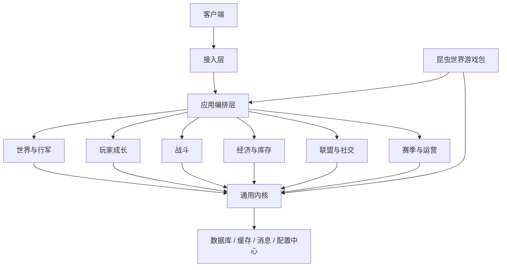

# 目标架构

> 状态：已接受  
> 适用阶段：设计收敛与首个可玩闭环

## 核心决策

采用“清晰限界上下文 + 模块化单体优先 + 可演进部署”的架构。DDD 用于约束模型和依赖，不用于强制每个上下文成为一个进程。



箭头表示依赖。领域模块不得依赖游戏包；基础设施通过接口适配领域层。

## 逻辑分层

每个限界上下文采用四层：

```text
interfaces → application → domain ← infrastructure
```

- `domain`：聚合、值对象、领域服务、仓储接口和领域事件，不依赖数据库、消息 SDK 或其他上下文实现；
- `application`：用例编排、事务边界、权限与幂等协调，只依赖领域接口；
- `interfaces`：gRPC、HTTP、WebSocket、消息消费适配；
- `infrastructure`：仓储、消息、配置和第三方实现，在启动入口注入。

跨聚合写入不得通过对象互调完成。单上下文内优先本地事务，跨上下文使用带幂等键的事件和 Outbox；只有确有实时返回要求时才同步调用。

## 建议限界上下文

| 上下文 | 主要职责 | 首个闭环 |
|---|---|---|
| Identity | 账号、会话、玩家身份 | 必需 |
| World | 地图、区域、位置、行军、采集调度 | 必需 |
| Growth | 玩家档案、建筑、训练、科技 | 必需 |
| Combat | 战斗快照、演算、战报、结算意图 | 必需 |
| Economy | 钱包、产出、消耗、背包 | 必需 |
| Social | 联盟、外交、社交关系 | 后置 |
| LiveOps | 赛季、活动、配置发布、审计 | 基础配置必需，复杂运营后置 |
| Match | 匹配、战场、排行 | 后置 |
| CrossServer | 跨服活动、合服 | 后置 |

表中是逻辑边界，不等于进程清单。现有仓库目录可逐步映射，禁止为了追求表面一致进行一次性搬家。

## 部署策略

默认部署为三个进程单元：

1. `gateway`：连接、鉴权、限流和协议适配；
2. `game`：首个闭环涉及的领域模块，以模块化单体运行；
3. `control`：配置发布、迁移、审计和后台任务。

当某上下文满足以下任一条件时，才提议独立服务，并通过 ADR 决策：

- 有独立且显著不同的扩缩容曲线；
- 故障需要与主链路隔离；
- 数据归属和团队边界长期稳定；
- 单进程资源竞争经过剖析确认；
- 发布节奏确实需要独立。

拆分后仍复用原 application/domain，接口适配层替换为 RPC 或事件，不重写领域模型。

## 配置与游戏包

目标目录在首个配置切片落地时建立：

```text
gamepacks/
└── insect-world/
    ├── manifest.yaml       游戏包标识、版本、兼容的引擎版本
    ├── configs/            经过 schema 校验的内容与数值
    ├── extensions/         昆虫专属行为注册
    └── tests/              配置契约、确定性和闭环用例
```

配置必须有 schema 版本、稳定 ID、依赖检查和升级策略。运行中实例绑定配置版本；禁止热更删除仍被实例引用的定义。

## 数据所有权

- 每张业务表只有一个上下文拥有写权限；
- 跨上下文查询使用 API、事件投影或只读副本，不直接写他域表；
- 资源、ID、状态和时间戳在持久化与协议层使用整数；
- 表名使用 `t_` + 单数蛇形，关联表使用 `t_<a>_<b>_rel`；
- 业务状态变更与 Outbox 在同一本地事务中提交。

## 非功能基线

首阶段只冻结可验证的约束：

- 确定性：相同战斗输入、随机种子和配置版本得到相同结果；
- 幂等：所有外部写命令和事件消费者可安全重试；
- 可恢复：断线重连、进程重启后核心状态可恢复；
- 可观测：关键命令有 trace、结构化日志和业务指标；
- 可演进：配置、事件和存储 schema 有显式版本；
- 可测试：领域逻辑不依赖运行中的数据库或网络。

吞吐、延迟、分片数量和容灾等级必须通过容量模型或压测再冻结，不能从其他项目模板直接复制。
